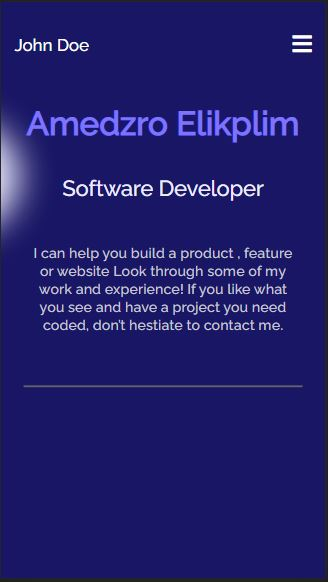

# Portfolio

> Professional personal portfolio website which showcase my personal information, skills and projects as a Fullstack software developer.

Additional description about the project and its features.

## Built With

- HTML
- CSS
- Webhint
- Stylelint

## Getting Started

To get a local copy up and running follow these simple example steps.

### Prerequisites
- Knowledge on basic html and css
- Text Editor (VScode, Atom, Sublime text, etc)
- Basic knowledge of node.js

### Setup
- clone repository using `git clone`
- run `npm install`
- run `live server`

## Authors

👤 **Amedzro Elikplim Emmanuel**

- GitHub: [@githubhandle](https://github.com/Amedzro-Elikplim)
- Twitter: [@twitterhandle](https://twitter.com/Amedzro-Elikplim)
- LinkedIn: [LinkedIn](https://www.linkedin.com/in/emmanuel-elikplim-amedzro-187590125/)

## 🤝 Contributing

Contributions, issues, and feature requests are welcome!

Feel free to check the [issues page](../../issues/).

## Show your support

Give a ⭐️ if you like this project!

## 📝 License

This project is [MIT](./MIT.md) licensed.